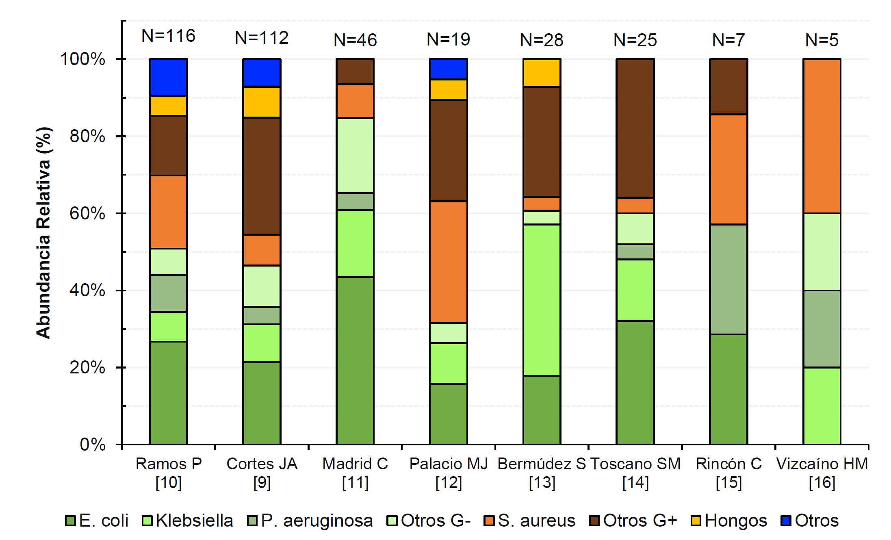
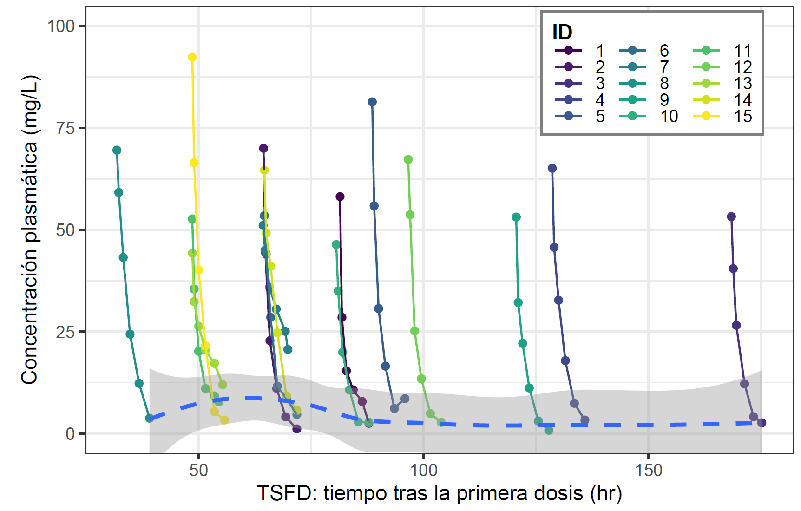

```{r setup, include=FALSE}
require(knitr)
require(htmltools)
require(tidyverse)
require(plotly)
suppressMessages(library(dplyr))
knitr::opts_chunk$set(echo = FALSE)
knitr::opts_chunk$set(warning = FALSE, message = FALSE)

fig <- file.path('figures')

van <- file.path('figures', 'VAN')
fep <- file.path('figures', 'FEP')

# knitr::raw_html(
# '<script type="text/x-mathjax-config">
#   MathJax.Hub.Config({
#     tex2jax: {
#       inlineMath: [ ["$","$"], ["\\(","\\)"] ],
#       processEscapes: true
#     }
#   });
# </script>'
# )
```
```{css slide-number-on, include=FALSE}
.remark-slide-number {
  display: inline;
}
.container{
    display: flex;
}
.col{
    flex: 1;
}
```

## Contenido {data-background-image="./www/FONDOPRESENTACION.png"}

1. <a href="#/Introducción" class="fragment aContenido">Introducción</a>
2. <a href="#/Objetivos" class="fragment aContenido">Objetivos</a>
3. <a href="#/Metodologia" class="fragment aContenido">Metodología</a>
4. <a href="#/ResFEP" class="fragment aContenido">Resultados de cefepime </a>
5. <a href="#/ResVAN" class="fragment aContenido">Resultados de vancomicina </a>
6. <a href="#/Conclusiones" class="fragment aContenido">Conclusiones</a>
7. <a href="#/Agradecimientos" class="fragment aContenido">Agradecimientos</a>

# Introducción {data-background-image="./www/FONDOPRESENTACION.png" id="Introducción"}


## Infecciones en pacientes con cáncer {data-background-image="./www/FONDOPRESENTACION.png"}

* Las complicaciones infecciosas son una causa importante de morbilidad y mortalidad en pacientes con cáncer, y suelen ser más frecuentes en pacientes con neoplasias hematológicas respecto a pacientes con tumores sólidos [@Zembower2014].

* Existen una serie de condiciones que se convierten en factores de riesgos para adquirir complicaciones infecciosas en pacientes con cáncer como [@Castagnola2014]:
  + **neutropenia** 
  + mucositis
  + implantación de catéteres venosos centrales
  + factores genéticos
  + uso de anticuerpos monoclonales u otros medicamentos biológicos
  + cirugías
  
* La fiebre es la manifestación más consistente y a veces la única de una infección en el paciente neutropénico [@Nesher2014].

<!-- Puede ser explicado por que la intensidad del tratamiento contra el cáncer es más alta en estas neoplasias -->

## Neutropenia febril {data-background-image="./www/FONDOPRESENTACION.png"}

::: {.row}
:::: {.column style="width:100%;"}
<br>
<br>

- Neutropenia caracterizada por una **disminución anormal del número de neutrófilos** en la sangre, definida por un conteo absoluto de neutrófilos menor a \(500~/\mu \mathrm{L}\) o \(<1000~/\mu \mathrm{L}\) que en las siguientes 48 horas tienda a disminuir por debajo de \(500~/\mu \mathrm{L}\) [@Cuervo-Maldonado2014].

- Fiebre definida por una temperatura oral única \(\geq 38.3°\mathrm{C}\) o una temperatura \(\geq 38°\mathrm{C}\) sostenida por más de una hora. 

---

- La fiebre en un paciente con neutropenia puede ser signo de una infección que amenaza la vida e indica la pronta aplicación de terapia empírica con antibióticos de amplio espectro [@Pizzo2019]. <!-------Mortalidad de 5 a 20%----------->

- El abordaje clínico implica la correcta elaboración de una historia clínica y la realización de un exámen físico exhaustivo para guiar la búsqueda microbiológica en el laboratorio [@Cuervo-Maldonado2014]. 

- La utilización de los antimicrobianos debe tener la mayor efectividad posible en estos pacientes para aumentar la probabilidad de supervivencia de los mismos. 

::::

:::: {.column style="width:80%; align:center;"}
  <div style = "text-align: center;">
  {width=50% align='center'}
  {width=50% align='center'}
  </div>
::::
:::
<!--  -->

## Causas de la neutropenia febril {data-background-image="./www/FONDOPRESENTACION.png"}

<div class="row" style="grid-template: 100% / 40% 1fr;">
<div class="column">
<p>Se ha documentado la frecuencia de los diagnósticos asociados a episodios de NF [@Nesher2014]</p>
<ul class="listado">
<li>Fiebre no explicada (45-50%)</li>
<li>Infecciones clínicamente no documentadas (20-25%)</li>
<li>Infecciones microbiológicas documentadas (20-25%)</li>
<li>Fiebre por causas no infecciosas (5%)</li>
</ul>
<br>
<p>En Colombia; la mayoría de aislamientos en pacientes con NF son relacionados a bacterias gram-negativas (\(\sim50\%\)); y asociada en una menor proporción a bacterias gram positivas (\(\sim30\%\)) [@Ramos2012; @CortesJA2013; @Madrid2013; @PalacioMesa2015; @BermudezSilva2009; @ToscanoRodriguez2015; @RinconFuerte2013; @VizcainoGarcia2014].<p>
</div>
<div class="column">

<p>Figura 01. Abundancia relativa de aislamientos en pacientes con NF en estudios en Colombia.</p>
</div>
</div>


<!-- ## Mortalidad en pacientes con cáncer {data-background-image="./www/FONDOPRESENTACION.png"} -->

<!-- Un análisis de las causas de muerte en pacientes oncológicos en EE.UU. muestra que una cohorte especialmente susceptible a muerte por causas no oncológicas, son pacientes jóvenes con neoplasias hematológicas [89]. La muerte en estos pacientes suele ocurrir durante el primer año tras el diagnóstico y suele estar asociada al tratamiento como es el caso de la neutropenia febril [89]. -->

<!-- En Colombia se ha observado una incidencia de cáncer de 2.1 (linfoma no Hodgkin), 1.9 (leucemia), 0.7 (mieloma múltiple), 0.5 (linfoma de Hodgkin) [88], y 45.6 (todos los cánceres excl. melanoma), esta incidencia observada es menor a la estimada por GLOBOCAN. Ade-más, se tiene una prevalencia de 18.8 (linfoma no Hodgkin), 12.9 (leucemia), 5.5 (mieloma múltiple), 4.7 (linfoma de Hodgkin), y 369.4 (todos los cánceres excl. melanoma) [88]. -->

<!-- Los pacientes con más alto riesgo de muerte no asociada al cáncer se pueden dividir en dos grupos: (a) aquellos con comorbilidades crónicas, y (b) aquellos con infecciones agu-das, iatrogénicas y asociadas al tratamiento [89]. Las comorbilidades crónicas más comu-nes son secundarias a enfermedades cardiovasculares (p. ej. falla cardíaca o accidentes cerebro-vasculares). -->

<!-- Con base a estadísticas vitales del DANE se espera para 2020 un total de 4655.0 (IC95% 4416-4894) muertes en Colombia relacionadas a neoplasias del tejido linfático, de los órganos hematopoyéticos y de tejidos afines [90]. Además, se espera para 2020 un total de 45324 (IC95% 43137-47510) muertes relacionadas a diferentes tumores sólidos a los men-cionados [90]. En la Tabla 2 se observan defunciones agrupadas para diferentes tipos de cáncer como diagnóstico principal en Colombia durante los años 2008 a 2017. En la Tabla 2 se observa que el número de muertes es relativamente alto en pacientes jóvenes como en leucemia linfoide, y linfoma de Hodgkin. -->

## Tratamiento con antibióticos {data-background-image="./www/FONDOPRESENTACION.png"}

<div class="row" style="grid-template: 100% / 40% 1fr;">
<div class="column fragment">
<ul>
<li><p>Estratificación del riesgo (escala MASCC)</p>
</li>
<li><p>Tratamiento empírico</p>
</li>
<li><p>En el caso intravenoso: </p>
<ul>
<li>Piperacilina/tazobactam</li>
<li>Cefepime</li>
<li>Ceftazidime</li>
<li>Vancomicina ?</li>
<li>Carbapenémico ?</li>
<li>Cobertura antifúngica ?</li>
</ul>
</li>
</ul>
</div>
<div class="column">
```{r condPacienteCritico, out.width='80%', fig.align='center'}
tags$div(
  class = "fragment fade-in",
  p(class = 'caption', 'Figura 02. Factores que afectan la farmacocinética de antibióticos en pacientes críticos'),
  img(
    src = normalizePath(file.path('figures', 'condicionesPacienteCritico.png')),
    width = '96%',
    alt = 'Factores que afectan la farmacocinética de antibióticos en pacientes críticos'
  )
)
```
</div>
</div>


# Objetivos {data-background-image="./www/FONDOPRESENTACION.png" id="Objetivos"}

* **Objetivo General**: Identificar covariables relacionadas a cambios fisiopatológicos en individuos con neutropenia febril posquimioterapia, que expliquen la variabilidad interindividual en los parámetros farmacocinéticos de cefepime y vancomicina en el tratamiento empírico de infecciones en estos individuos.

* **Objetivos Específicos**: 
    + Estimar modelos de farmacocinética poblacional para cefepime y vancomicina obtenidos en el marco de los estudios realizados en pacientes con neoplasias hematológicas y neutropenia febril posquimioterapia del Instituto Nacional de Cancerología.
    + Analizar el efecto de diversos factores fisiológicos y patológicos en la farmacocinética de cefepime y vancomicina, con el fin de desarrollar un modelo farmacocinético final con covariables.
    + Establecer la capacidad predictiva del modelo farmacocinético poblacional final mediante procedimientos de evaluación interna.
    + Analizar diversos regímenes de dosificación en cuanto a su capacidad de obtener concentraciones de los antibióticos en un margen terapéutico adecuado, de acuerdo a indicadores PK-PD previamente definidos.
    + Contrastar diferentes recomendaciones de dosis inicial en el tratamiento empírico de infecciones en pacientes con neutropenia febril, teniendo en cuenta las covariables identificadas, y posibles patrones de resistencia bacteriana.


# Metodología {data-background-image="./www/FONDOPRESENTACION.png"  id="Metodologia"}

## Modelo de regresión no lineal de efectos mixtos

<br>
**Nivel 1**: modelo de observaciones (variación intraindividual)
<br>

\[y_{ij} = f(\beta_i, x_{ij}, t_{ij}) + \epsilon_{ij},\qquad j = 1, \dots, m_{n}\]

\[\epsilon_{ij} \sim \mathcal{N}(0, g(\beta, \Phi)))\]

<br>
<br>
**Nivel 2**: modelo de parámetros (variación interindividual)
<br>

\[\beta_i \underset{iid}{\sim} \left(h(z_i, \theta), \omega_{\beta_i}^2 \right),\qquad i = 1, \dots, n\]

Donde, \(\theta\) es el vector de parámetros poblacionales, \(\beta_i\) es el vector de parámetros para el individuo \(i\), \(z_i\) es el vector de covariables, \(x_{ij}\) se refiere al régimen de dosificación, \(t_{ij}\) es el tiempo \(j\) medido para el individuo \(i\), \(\omega_{\beta_i}^2\) es la matriz de varianza-covarianza y \(\epsilon_{ij}\) es la variabilidad residual. \(f\), \(g\) y \(h\) son las funciones de modelos estructurales, de error residual y de relación con covariables. 

## Proceso de modelamiento en farmacocinética poblacional

```{r procesoModelamiento, out.width='80%', fig.cap="Proceso de modelamiento", fig.align='center'}
tags$div(
  img(
    src = normalizePath(file.path('figures', '011_procesoModelamiento.png')),
    width = '70%',
    alt = 'Figura 1. Proceso de modelamiento '
  ),
  p(class = 'caption', 'Figura 1. Proceso de modelamiento de farmacocinética poblacional.'),
  p(
    tags$strong('Adaptado de: '), 
    'Byon W, Smith MK, Chan P, Tortorici MA, Riley S, Dai H, et al. Establishing best practices and guidance in population modeling: An experience with an internal population pharmacokinetic analysis guidance. ',
    tags$i('CPT Pharmacometrics Syst Pharmacol'),
    ' 2013;2(7):1–8.',
    style = "font-size:small;"
  )
)
```

## Predicciones individuales vs poblacionales {data-background-image="./www/FONDOPRESENTACION.png"}

```{r ComparacionPredicciones, out.width='70%', out.height='32rem', cache=FALSE, fig.align='center'}
tags$div(
  style = "width: 96%; align-self: center; align-content: center; text-align: center; margin: auto; padding-left: 5%; padding-right: 5%;",
  id = 'ComparacionPredicciones',
  # 
  readRDS(file.path('figures', '001_prediccicionesComparacion.rds')),
  p(class = 'caption', 'Figura 03. Comparación de predicciones individuales y poblacionales')
)
```


## Residuales individuales vs poblacionales {data-background-image="./www/FONDOPRESENTACION.png"}
```{r ComparacionResiduales, out.width='100%', out.height='32rem', cache=FALSE, fig.align='center'}
tags$div(
  style = "width: 96%; align-self: center; align-content: center; text-align: center; margin: auto; padding-left: 5%; padding-right: 5%;",
  id = "ComparacionResiduales",
  # 
  readRDS(file.path('figures', '010_residualesComparacion.rds')),
  p(class = 'caption', 
    'Figura 04. Gráficos de residuales (IWRES, NPDE o PWRES) comparados con tiempo o \\(\\mathrm{C_{PRED}}\\)',
    '.')
)
```

## Simulaciones: índices PK-PD {data-background-image="./www/FONDOPRESENTACION.png"}

```{r PerfilPlasmatico1, out.width='100%', out.height='32rem'}
tags$div(class = 'row', style = "grid-template: 100% / 68% 1fr;",
         tags$div(class = 'column',
                  tags$div(
                    img(
                      src = normalizePath(file.path('figures', '002_perfil_plasmatico.png')),
                      width = '100%',
                      alt = 'Esquema de la definición de principales índice PK/PD'
                    ),
                    p(
                      class = 'caption',
                      'Figura 05. Esquema de la definición de principales índice PK/PD'
                    )
                  )),
         tags$div(class = 'column',
                  p('Probabilidad de alcanzar el objetivo farmacodinámico (PTA)'),
                  p("$$\\mathrm{PTA} = \\frac{1}{K}\\sum_{k=1}^{K}{1_{\\mathrm{PDI^{(k)}\\geq PDI^{*}}}}$$"),
                  p('Fracción de respuesta acumulada (CFR)'),
                  p("$$\\mathrm{CFR} = \\sum_{i}^{N}{\\mathrm{PTA}(\\mathrm{MIC}_i) \\cdot \\mathrm{F}(\\mathrm{MIC}_i)}$$")
                  ))
```

## Simulaciones: estudio del comportamiento de indicadores y PTA {data-background-image="./www/FONDOPRESENTACION.png"}

```{r PerfilPlasmatico2, out.width='90%'}
tags$div(class = 'row',
         tags$div(class = 'column', width = "40%", img(src = normalizePath(
           file.path('figures', '003_PTA_1.png')
         )),
         p(class='caption', 'Figura 06. \\(\\mathrm{PTA_{50}}\\) vs \\(\\mathrm{MIC}\\) con umbral del \\(90\\%\\)')
         ),
         tags$div(class = 'column', width = "40%", img(src = normalizePath(
           file.path('figures', '004_PTA_2.png')
         )),
         p(class='caption', 'Figura 07. \\(_{f}\\mathrm{T_{>MIC}}\\) vs \\(\\mathrm{MIC}\\) con línea segmentada en objetivo')
         ), )
```

# Resultados para cefepime {data-background-image="./www/FONDOPRESENTACION.png" id="ResFEP"}

## Metodología {data-background-image="./www/FONDOPRESENTACION.png"}

<div class="row">
<div class="column">
<p>Estudio descriptivo, observacional, prospectivo, no aleatorizado en 15 pacientes con neoplasias hematológicas y en tratamiento empírico para neutropenia febril posquimioterapia con cefepime [@JCAR2015].</p><br><ul class="listado"><li><b>Criterios de inclusión:</b></li><li>Pacientes mayores de 18 años con diagnóstico de neoplasia hematológica confirmada <i>de novo</i> o en tratamiento (mantenimiento o recaída)</li><li>En tratamiento empírico de neutropenia febril con cefepime.</li>
<br>
<li><b>Criterios de exclusión: </b></li>
<li>Insuficiencia renal crónica</li>
<li>Falla hepática</li>
<li>Comorbilidades mayores (p.ej. diabetes, falla cardíaca, hipotiroidismo)</li>
<li>Embarazo</li>
<li>Terapia antimicrobiana en combinación</li>
</ul>


</div>
<div class="column">
<table class="tg" style="align: center;">
<thead>
<tr>
<th class="tg-fymr">Parámetro</th>
<th class="tg-fymr" colspan="2">Valor Medio</th>
</tr>
</thead>
<tbody>
<tr>
<td class="tg-btxf">Edad (años) [Media (IC95%)]</td>
<td class="tg-btxf">40.07</td>
<td class="tg-btxf">(34.30−45.83)</td>
</tr>
<tr>
<td class="tg-0lax">Sexo (Mujer / Hombre)</td>
<td class="tg-baqh" colspan="2">5 / 10</td>
</tr>
<tr>
<td class="tg-btxf">Peso (kg) [Media (IC95%)]</td>
<td class="tg-btxf">67.73</td>
<td class="tg-btxf">(63.82−71.65)</td>
</tr>
<tr>
<td class="tg-0pky">Talla (cm) [Media (IC95%)]</td>
<td class="tg-0pky">167.33</td>
<td class="tg-0pky">(163.35−171.32)</td>
</tr>
<tr>
<td class="tg-btxf">IMC (\(\mathrm{kg/m^{2}}\)) [Media (IC95%)]</td>
<td class="tg-btxf">24.20</td>
<td class="tg-btxf">(23.12−25.27)</td>
</tr>
<tr>
<td class="tg-0pky">Superficie corporal (\(\mathrm{m^{2}}\)) [Media (IC95%)]</td>
<td class="tg-0pky">1.76</td>
<td class="tg-0pky">(1.70−1.83)</td>
</tr>
<tr>
<td class="tg-btxf">\(\mathrm{S_{CR}}\) (mg/dL) [Mediana (IQR)]</td>
<td class="tg-btxf">0.54</td>
<td class="tg-btxf">(0.48−0.57)</td>
</tr>
<tr>
<td class="tg-0pky"> eGFR (\(\mathrm{mL/min/1.73m^{2}}\)) [Media (IC95%)]</td>
<td class="tg-0pky">127.16</td>
<td class="tg-0pky">(119.63−134.69)</td>
</tr>
<tr>
<td class="tg-btxf">Proteínas (g/dL) [Mediana (IQR)]</td>
<td class="tg-btxf">5.90</td>
<td class="tg-btxf">(5.46−6.10)</td>
</tr>
<tr>
<td class="tg-0pky">Albúmina (g/dL) [Media (IC95%)]</td>
<td class="tg-0pky">3.35</td>
<td class="tg-0pky">(3.09−3.61)</td>
</tr>
<tr>
<td class="tg-btxf">DIND (días) [Mediana (IQR)]</td>
<td class="tg-btxf">6.00</td>
<td class="tg-btxf">(4.50−6.50)</td>
</tr>
<tr>
<td class="tg-0pky">DNFD (días) [Mediana (IQR)]</td>
<td class="tg-0pky">4.00</td>
<td class="tg-0pky">(3.00−4.50)</td>
</tr>
<tr>
<td class="tg-btxf">RAL (\(\mathrm{/mm^3}\)) [Mediana (IQR)]</td>
<td class="tg-btxf">430.0</td>
<td class="tg-btxf">(315.0−565.0)</td>
</tr>
<tr>
<td class="tg-0pky">RAN (\(\mathrm{/mm^3}\)) [Mediana (IQR)]</td>
<td class="tg-0pky">30.0</td>
<td class="tg-0pky">(20.0−95.0)</td>
</tr>
</tbody>
</table>
<p class='caption'>Tabla 01. Características demográficas, clínicas y de laboratorio de los pacientes de estudio de cefepime.</p>
</div>

</div>


## Datos de concentración y tiempo de cefepime {data-background-image="./www/FONDOPRESENTACION.png"}
<div class="row">
<div class="column">

<p class='caption'>Figura 08. Gráfico con perfil de \(\mathrm{C_{p}}\) vs \(\mathrm{TSFD}\).</p>
</div>
<div class="column">

<p class='caption'>Figura 09. Gráfico con perfil de \(\log{\mathrm{C_{p}}}\) vs \(\mathrm{TAD}\).</p>
</div>
</div>

## FEP modelo final {data-background-image="./www/FONDOPRESENTACION.png"}

```{r FEP-ModeloFinal, out.width='100%', out.height='32rem'}
tags$div(
  p(class = 'caption', 'Tabla 02. Parámetros estimados para modelo final de cefepime'),
  img(
    src = normalizePath(file.path(fep, '225_FEP_modeloFinal.png')),
    width = '65%',
    alt = 'Parámetros estimados para modelo final de cefepime'
  )
)
```

## FEP gráficos de bondad de ajuste {data-background-image="./www/FONDOPRESENTACION.png"}

```{r FEP-FinalGOF, out.width='100%'}
cap <- 'Gráficos diagnósticos de bondad de ajuste para el modelo con covariable. (A) observaciones (OBS) vs predicciones poblacionales (PRED), (B) OBS vs predicciones individuales (IPRED), (C) OBS vs PRED en escala logarítmica, y (D) OBS vs IPRED en escala logarítmica.'

tags$div(
  img(
    src = normalizePath(file.path(fep, '227_FEP_GraficosGOF.png')),
    width = '70%', alt = cap
  ),
  p(class = 'caption', paste0('Figura 10. ', cap))
)
```
## FEP gráficos de residuales {data-background-image="./www/FONDOPRESENTACION.png"}

```{r FEP-FinalResiduales, out.width='100%'}
cap <- 'Gráfico de dispersión de residuales para modelo con covariable. (A) PWRES vs TAD, (b) PWRES vs PRED, (c) IWRES vs TAD, (D) IWRES vs PRED, (E) NPDE vs TAD, y (F) NPDE vs PRED.'

tags$div(
  img(
    src = normalizePath(file.path(fep, '228_FEP_GraficosResiduales.png')),
    width = '70%', alt = cap
  ),
  p(class = 'caption', paste0('Figura 11. ', cap))
)
```

## FEP diagnósticos basados en simulación {data-background-image="./www/FONDOPRESENTACION.png"}

```{r FEP-pcVPC, out.width='100%', out.height='32rem'}
tags$div(
  img(
    src = normalizePath(file.path(fep, '226_FEP_pcVPC.png')),
    width = '80%',
    alt = 'Gráficos diagnósticos basados en simulación para modelo final de FEP'
  ),
  p(class = 'caption', 'Figura 12. Gráficos diagnósticos basados en simulación para modelo final de FEP. (A) Chequeo predictivo visual corregido por predicción (pcVPC). (B) Chequeo predictivo numérico (NPC).')
)
```

## Comparación entre con otros estudios {data-background-image="./www/FONDOPRESENTACION.png"}
```{r FEP-Validacion, out.width='100%'}
cap <- 'Comparación del modelo y otros estudios mediante indicador de rendimiento predictivo'
tags$div(
  p(class = 'caption', paste0('Figura 13. ', cap)),
  img(
    src = normalizePath(file.path(fep, '250_validacion_externa.png')),
    width = '90%', alt = cap )
)
```


## FEP perfil cinético de regímenes simulados {data-background-image="./www/FONDOPRESENTACION.png"}

```{r FEP-PerfilSimulado, out.width='100%', out.height='32rem'}
cap <- 'Predicción del modelo para 12 regímenes de dosificación con dosis diarias totales de: 2g, 4g y 6g, en las filas, y diferentes ventanas de tiempo en las columnas, fases inicial (INI) y de estado estacionario (SS)'
tags$div(
  p(class = 'caption', paste0('Figura 14. ', cap)),
  img(
    src = normalizePath(file.path(fep, '236_FEP_RegimenesSimulados.png')),
    width = '50%', alt = cap )
)
```   
## FEP Simulaciones PTA para indicado \(100_{f}\mathrm{T_{>MIC}}\) {data-background-image="./www/FONDOPRESENTACION.png"}

```{r FEP-PTA-1, out.width='100%', out.height='32rem'}
cap <- 'PTA de \\(100_{f}\\mathrm{T_{>MIC}}\\) para los 12 regímenes de dosificación simulados.'
tags$div(
  p(class = 'caption', paste0('Figura 15. ', cap)),
  img(
    src = normalizePath(file.path(fep, '234_FEP_PTA_Indicador_100.png')),
    width = '50%', alt = cap )
)
```   

## FEP Simulaciones PTA para indicado \(60_{f}\mathrm{T_{>MIC}}\) {data-background-image="./www/FONDOPRESENTACION.png"}
```{r FEP-PTA-2, out.width='100%', out.height='32rem'}
cap <- 'PTA de \\(60_{f}\\mathrm{T_{>MIC}}\\) para los 12 regímenes de dosificación simulados.'
tags$div(
  p(class = 'caption', paste0('Figura 16. ', cap)),
  img(
    src = normalizePath(file.path(fep, '235_FEP_PTA_Indicador_50.png')),
    width = '50%', alt = cap )
)
```   


## Simulaciones de CFR 1 para FEP {data-background-image="./www/FONDOPRESENTACION.png"}

```{r FEP-CFR-1, out.width='90%', out.height='32rem'}
cap <- 'CFR para varios regímenes de dosificación de FEP en estado estacionario frente a distribuciones EUCAST de varios microorganismos'
tags$div(
  p(class = 'caption', paste0('Tabla 03. ', cap)),
  img(
    src = normalizePath(file.path(fep, '230_FEP_CFR_EUCAST.png')),
    width = '72%', alt = cap )
)
```   


## Simulaciones de CFR 2 para FEP {data-background-image="./www/FONDOPRESENTACION.png"}

```{r FEP-CFR-2, out.width='100%', out.height='32rem'}
cap <- 'Comparación de CFR de cefepime en el tratamiento empírico y el tratamiento dirigido para tres microorganismos.'
tags$div(
  p(class = 'caption', paste0('Tabla 04. ', cap)),
  img(
    src = normalizePath(file.path(fep, '231_FEP_CFR_Tratamiento_Empirico.png')),
    width = '70%', alt = cap )
)
```   

## FEP Simulaciones PTA por eGFR {data-background-image="./www/FONDOPRESENTACION.png"}

```{r FEP-PTA-SCR, out.width='100%', out.height='32rem'}
cap <- 'PTA vs MIC para diferentes niveles de creatinina sérica, para una dosis de 2g q8h en infusión de 30 minutos'
tags$div(
  img(
    src = normalizePath(file.path(fep, '232_FEP_PTA_eGFR.png')),
    width = '70%', alt = cap ),
  p(class = 'caption', paste0('Figura 17. ', cap))
)
```   

# Resultados para vancomicina {data-background-image="./www/FONDOPRESENTACION.png" id="ResVAN"}

## Metodología {data-background-image="./www/FONDOPRESENTACION.png"}

<div class="row">
<div class="column">
<p>Estudio descriptivo, observacional, prospectivo, no aleatorizado en 12 pacientes con neoplasias hematológicas y en tratamiento empírico para neutropenia febril posquimioterapia con vancomicina [@JAPM2016].</p><br><ul class="listado"><li><b>Criterios de inclusión:</b></li><li>Pacientes mayores de 18 años con diagnóstico de neoplasia hematológica confirmada <i>de novo</i> o en tratamiento (mantenimiento o recaída)</li><li>En tratamiento empírico de neutropenia febril con vancomicina.</li>
<br>
<li><b>Criterios de exclusión: </b></li>
<li>Insuficiencia renal crónica</li>
<li>Falla hepática</li>
<li>Comorbilidades mayores (p.ej. diabetes, falla cardíaca, hipotiroidismo)</li>
<li>Embarazo</li>
<li>Infección por VIH/SIDA</li>
</ul>
</div>

<div class="column">
<table class="tg">
<thead>
  <tr>
    <th class="tg-0lax">Parámetro</th>
    <th class="tg-amwm">Valor</th>
    <th class="tg-amwm">Rango</th>
  </tr>
</thead>
<tbody>
  <tr>
    <td class="tg-j58y">Edad (años) [Media (IC95%)]</td>
    <td class="tg-pt8k">44 (33.60, 54.40)</td>
    <td class="tg-pt8k">20.00, 79.00</td>
  </tr>
  <tr>
    <td class="tg-0lax">Sexo (mujer / hombre)</td>
    <td class="tg-baqh" colspan="2"> 6 / 8 </td>
  </tr>
  <tr>
    <td class="tg-j58y">Peso (kg) [Mediana (IQR)]</td>
    <td class="tg-pt8k">60.0 (55.0, 67.0)</td>
    <td class="tg-pt8k">52.0, 84.0</td>
  </tr>
  <tr>
    <td class="tg-7zrl">Talla (cm) [Media (IC95%)]</td>
    <td class="tg-8d8j">163.86 (159.30, 168.42)</td>
    <td class="tg-8d8j">152.0, 181.0</td>
  </tr>
  <tr>
    <td class="tg-j58y">Superficie corporal (\(\mathrm{m^{2}}\)) [Mediana (IQR)]</td>
    <td class="tg-pt8k">1.635 (1.554, 1.715)</td>
    <td class="tg-pt8k">1.506, 2.046</td>
  </tr>
  <tr>
    <td class="tg-7zrl">\(\mathrm{S_{CR}}\) (mg/dL) [Media (IC95%)]</td>
    <td class="tg-8d8j">0.582 (0.501, 0.663)</td>
    <td class="tg-8d8j">0.37, 0.80</td>
  </tr>
  <tr>
    <td class="tg-j58y">\(\mathrm{eGFR}\) (\(\mathrm{mL/min/1.73m^2}\)) [Media (IC95%)]</td>
    <td class="tg-pt8k">120.33 (109.94, 130.72)</td>
    <td class="tg-pt8k">86.31, 152.31</td>
  </tr>
  <tr>
    <td class="tg-7zrl">Proteínas (g/dL) [Media (IC95%)]</td>
    <td class="tg-8d8j">5.593 (5.066, 6.120)</td>
    <td class="tg-8d8j">3.800, 7.100</td>
  </tr>
  <tr>
    <td class="tg-j58y">Albúmina (g/dL) [Media (IC95%)]</td>
    <td class="tg-pt8k">3.121 (2.836, 3.407)</td>
    <td class="tg-pt8k">2.30, 3.98</td>
  </tr>
  <tr>
    <td class="tg-7zrl">RAL (\(\mathrm{/mm^3}\)) [Mediana (IQR)]</td>
    <td class="tg-8d8j">960 (650, 1260)</td>
    <td class="tg-8d8j">180, 6520</td>
  </tr>
  <tr>
    <td class="tg-j58y">RAN (\(\mathrm{/mm^3}\)) [Media (IC95%)]</td>
    <td class="tg-pt8k">264 (187, 341)</td>
    <td class="tg-pt8k">80, 490</td>
  </tr>
</tbody>
</table>
<p class='caption'>Tabla 05. Características demográficas, clínicas y de laboratorio de los pacientes de estudio de vancomicina.</p>
</div>

</div>

## Datos de concentración vs tiempo de vancomicina {data-background-image="./www/FONDOPRESENTACION.png"}


<p class='caption'>Figura 18. Gráfico exploratorio de perfil farmacocinético de VAN en dominio logarítmico.</p>

## Parámetros esimados para modelo final de VAN {data-background-image="./www/FONDOPRESENTACION.png"}

```{r VAN-ModeloFinal, out.width='100%', out.height='32rem'}
tags$div(
  p(class = 'caption', 'Tabla 06. Parámetros estimados para modelo final de vancomicina'),
  img(
    src = normalizePath(file.path(van, '400_VAN_modeloFinal.png')),
    width = '65%',
    alt = 'Parámetros estimados para modelo final de vancomicina'
  )
)
```

## VAN gráficos de bondad de ajuste {data-background-image="./www/FONDOPRESENTACION.png"}

```{r VAN-FinalGOF, out.width='100%'}
cap <- 'Gráficos diagnósticos de bondad de ajuste para el modelo con covariable. (A) observaciones (OBS) vs predicciones poblacionales (PRED), (B) OBS vs predicciones individuales (IPRED), (C) OBS vs PRED en escala logarítmica, y (D) OBS vs IPRED en escala logarítmica.'

tags$div(
  img(
    src = normalizePath(file.path(van, '001_y_G_GOF.png')),
    width = '65%',
    alt = 'GOF modelo final de vancomicina'
  ),
  p(class = 'caption', paste0('Figura 19. ', cap))
)
```

## VAN gráficos de residuales {data-background-image="./www/FONDOPRESENTACION.png"}

```{r VAN-FinalResiduales, out.width='100%'}
cap <- 'Gráfico de dispersión de residuales para modelo con covariable. (A) PWRES vs TAD, (b) PWRES vs PRED, (c) IWRES vs TAD, (D) IWRES vs PRED, (E) NPDE vs TAD, y (F) NPDE vs PRED.'

tags$div(
  img(
    src = normalizePath(file.path(van, '002_y_G_RES.png')),
    width = '75%',
    alt = 'Gráfico de dispersión de residuales de VAN'
  ),
  p(class = 'caption', paste0('Figura 20. ', cap))
)
```

## VAN control predictivo visual {data-background-image="./www/FONDOPRESENTACION.png"}
```{r VAN-pcVPC, out.width='100%', out.height='32rem'}
tags$div(
  img(
    src = normalizePath(file.path(van, '016_pcVPC_IC.png')),
    width = '75%',
    alt = 'Gráfico de dispersión de residuales de VAN'
  ),
  p(class = 'caption', 'Figura 21. Chequeo predictivo visual para modelo final de VAN. (A) Observaciones por método microbiológico, y (B) Observaciones por método de quimioluminiscencia.')
)
```

## Comparación de modelo de VAN desarrollado con otros modelos {data-background-image="./www/FONDOPRESENTACION.png"}

```{r VAN-valExt1, out.width='100%', out.height='32rem'}
tags$div(
  readRDS(file.path(van, '002_perfilCompuestoSIM.rds')),
  # tags$iframe(
  #   src = normalizePath(file.path(van, '002_perfilCompuestoSIM.html')),
  #   width = '100%',
  #   height = '450pt'
  # ),
  p(class = 'caption', 'Figura 22. Perfiles plasmáticos para poblaciones alrededor del individuo típico.')
)
```

## Simulación a partir de modelo final de VAN  {data-background-image="./www/FONDOPRESENTACION.png"}

```{r VAN-Simul1, out.width='100%', out.height='32rem'}
tags$div(
  img(
    src = normalizePath(file.path(van, '050_perfilPlasmaticoCrCldesconocido.png')),
    width = '75%',
    alt = 'Gráfico de dispersión de residuales de VAN'
  ),
  p(class = 'caption', 'Figura 23. Perfiles plasmáticos simulados para varios regímenes de dosificación de VAN en poblaciones con eGFR indeterminado.')
)
```


## Comparación de PTA de \(\mathrm{AUC/MIC} \geq 400 \mathrm{mg\cdot h/L}\) DD vs MIC {data-background-image="./www/FONDOPRESENTACION.png"}

```{python VAN PKPD-1, out.width='100%', out.height='32rem', fig.align="center"}
import pickle
import plotly.graph_objects as go

def crearFiguras(ruta):
  fig = pickle.load(open(ruta, 'rb'))
  # fig.update_traces(surface = {'colorscale': 'Spectral'}, overwrite=True)
  fig.update_traces(colorscale="Spectral", selector=dict(type='surface'), overwrite=True)
  fig.update_layout(title = "", overwrite=True)
  return fig

crearFiguras("./figures/VAN/011_superficiePTA_dosis_MIC.pickle").show(config = {'displayModeBar': False}, width = 1000, height = 800)
```
<p class="caption">Figura 24. Comparación de dosis diaria vs MIC para indicador \\(\\mathrm{AUC/MIC} \\geq 400 \\mathrm{mg\\cdot h/L}\\) </p>

## Simulación de PTA para objetivo \(\mathrm{AUC/MIC} \geq 400 \mathrm{mg\cdot h/L}\) de VAN  {data-background-image="./www/FONDOPRESENTACION.png"}

```{r VAN-Simul2, out.width='100%', out.height='32rem'}
tags$div(
  p(class = 'caption', 'Figura 25. Superficies de respuesta de PTA para objetivo \\(\\mathrm{AUC/MIC} \\geq 400  \\mathrm{mg\\cdot h/L}\\).'),
  img(
    src = normalizePath(file.path(van, '019_superficiePTA_dosis_MIC.png')),
    width = '65%',
    alt = 'Gráfico de dispersión de residuales de VAN'
  )
)
```

## Comparación de variables que afectan PTA en objetivos secundarios {data-background-image="./www/FONDOPRESENTACION.png"}

```{python VAN-PKPD-2, out.width='100%', out.height='32rem', fig.align="center"}
crearFiguras("./figures/VAN/112_superficiePTA_dosis_MIC6.pickle").show(config = {'displayModeBar': False}, width = 1000, height = 800)
```
<p class="caption">Figura 26. Comparación de dosis diaria vs MIC en PTA de objetivos secundarios. Regímenes de VAN con infusiones de 2 horas y \\(\\mathrm{T_{inf}}\\) de 2 horas.) </p>


## Simulación de PTA para objetivo PK/PD \(\mathrm{AUC}\) entre 400 a 600 \(\mathrm{mg\cdot h/L}\) {data-background-image="./www/FONDOPRESENTACION.png"}

```{r VAN-Simul3, out.width='100%', out.height='32rem'}
tags$div(
  img(
    src = normalizePath(file.path(van, '106_superficiePTA_CLCR_DD_PTA1.png')),
    width = '85%',
    alt = 'Gráfico de dispersión de residuales de VAN'
  ),
  p(class = 'caption', 'Figura 27. Comportamiento de PTA para el objetivo \\(\\mathrm{AUC}\\) entre 400 a 600 \\(\\mathrm{mg\\cdot h/L}\\).')
)
```

## Simulación de PTA para objetivo PK/PD \(\mathrm{C_{min}}\) entre 15 a 20 \(\mathrm{mg/L}\) {data-background-image="./www/FONDOPRESENTACION.png"}
```{r VAN-Simul4, out.width='100%', out.height='32rem'}
tags$div(
  img(
    src = normalizePath(file.path(van, '107_superficiePTA_CLCR_DD_PTA2.png')),
    width = '85%',
    alt = 'Gráfico de dispersión de residuales de VAN'
  ),
  p(class = 'caption', 'Figura 28. Comportamiento de PTA para el objetivo \\(\\mathrm{C_{min}}\\) entre 15 a 20 \\(\\mathrm{mg/L}\\).')
)
```

## Simulaciones de CFR para VAN  {data-background-image="./www/FONDOPRESENTACION.png"}
```{r VAN-CFR-1, out.width='100%', out.height='32rem'}
tags$div(
  img(
    src = normalizePath(file.path(van, '200_VAN_CFR_1.png')),
    width = '65%',
    alt = 'Gráfico de dispersión de residuales de VAN'
  ),
  p(class = 'caption', 'Figura 29. Respuesta fraccional acumulada para varios regímenes de dosificación de VAN en estado estacionario frente a distribuciones EUCAST de varios microorganismo de interés.')
)
```

## Factores que explican a los modelos  {data-background-image="./www/FONDOPRESENTACION.png"}
```{r Shapley, out.width='100%', out.height='32rem'}
tags$br()
tags$div(
  img(
    src = normalizePath(file.path(van, '211_valoresShap1.png')),
    width = '100%',
    alt = 'Gráfico de dispersión de residuales de VAN'
  ),
  p(class = 'caption', 'Figura 30. Valores SHAP de modelo ANN para la predicción de PTA de acuerdo al diferentes objetivos PK-PD. (A) \\(\\mathrm{AUC/MIC} \\geq 400\\), (B) \\(\\mathrm{AUC}\\) entre 400 a 600 \\(\\mathrm{mg \\cdot h/L}\\), y (C) \\(\\mathrm{C_{min}}\\) entre 15 a 20 mg/L.')
)
```

# Conclusiones {data-background-image="./www/FONDOPRESENTACION.png" id="Conclusiones"}

## Conclusiones 1 {data-background-image="./www/FONDOPRESENTACION.png"}

> Para cefepime se desarrolló un modelo de dos compartimentos con una matriz de variabilidad interindividual en forma diagonal y error residual en forma aditiva. El modelo tiene al aclaramiento (\(\mathrm{Cl}\)) de FEP para un individuo como una función de la concentración sérica de creatinina (\(\mathrm{S_{CR}}\)) del mismo.

> Para vancomicina se desarrolló un modelo de dos compartimentos con una matriz de variabilidad interindividual en forma diagonal con correlación entre los parámetros \(\mathrm{V_1}\) y \(\mathrm{V_2}\), y error residual en forma aditiva. Se tiene que el aclaramiento (\(\mathrm{Cl}\)) de VAN para un individuo es una función del aclaramiento de creatinina (\(\mathrm{ClCr}\)) del mismo, y el error residual se encuentra en función del método de determinación de concentración de VAN.


## Conclusiones 2 {data-background-image="./www/FONDOPRESENTACION.png"}

> Para cefepime se realizaron simulaciones teniendo en cuenta los objetivos PK/PD de \(60_{f}\mathrm{T_{>MIC}}\) y \(100_{f}\mathrm{T_{>MIC}}\). Mediante simulación se encuentra que las acciones con mayor impacto en el mejoramiento de PTA son disminuir el intervalo de interdosificación (II) y aumentar el tiempo de infusión (\(\mathrm{T_{inf}}\)), los cambios en la dosis no mostraron un impacto importante en el PTA.

> La disminución de los niveles de \(\mathrm{S_{CR}}\) (relacionadas con un aumento en \(\mathrm{ClCr}\) se asocian con una disminución de PTA. Al evaluar la CFR se encuentra que la necesidad de infusiones extendidas o continuas depende del microorganismo del cual se tenga sospecha como causa de la infección y de los perfiles de resistencia locales.

> Para vancomicina se realizaron simulaciones teniendo en cuenta el indicador \(\mathrm{AUC/MIC} \geq 400 \mathrm{mg\cdot h/L}\), y se encuentra que este indicador se ve afectado principalmente por la dosis diaria en el tratamiento, así como \(\mathrm{ClCr}\), sin un efecto importante de \(\mathrm{II}\) o \(\mathrm{T_{inf}}\). Se encuentra que una dosis de 1g q12h es efectiva en el tratamiento de infecciones por bacterias con un \(\mathrm{MIC}\) de 1 mg/L, en pacientes con un aclaramiento mayor a 120 mL/min se requiere un aumento de la dosis a 1.5g diarios.

> En adición, se evaluaron dos indicadores PK/PD alternativos: (i) \(\mathrm{AUC}\) entre \(\mathrm{400-600 \mathrm{mg\cdot h/L}}\) y (ii) \(\mathrm{C_{min}}\) entre \(15-20\mathrm{mg/L}\), se encuentra que estos indicadores no se pueden cumplir de forma satisfactoria con ningún régimen de dosificación. La incapacidad de cumplir de forma satisfactoria el primer indicador sugiere la necesidad de realizar seguimiento farmacoterapéutico en estos pacientes ya que se podría presentar riesgo de toxicidad por un \(\mathrm{AUC} > 600 \mathrm{mg\cdot h/L}\)). El objetivo PK/PD \(\mathrm{C_{min}}\) es un mal indicador subrogado de \(\mathrm{AUC}\) ya que se ve afectado por otros factores como \(\mathrm{T_{inf}}\) a diferencia de \(\mathrm{AUC}\).


## Recomendaciones {data-background-image="./www/FONDOPRESENTACION.png"}

> Los modelos desarrollados podrían ser aplicados en la práctica clínica para generar parámetros de exposición y evaluar el cumplimiento de objetivos PK/PD a través de estimación bayesiana.

> Los modelos desarrollados no fueron evaluados mediante una validación externa formal, esta validación podría ser el objetivo de estudios posteriores.

> Los resultados encontrados mediante simulación deben ser confirmados a través de estudios controlados con una mayor cantidad de individuos y un diseño experimental apropiado. 

> En la revisión de la literatura se encuentran pocos estudios farmacodinámicos que evalúen el efecto en desenlaces negativos como efectos adversos, deberían realizarse más estudios específicos para desarrollar modelos que permitan explicar los factores que pueden llevar a estos desenlaces.

## Productos {data-background-image="./www/FONDOPRESENTACION.png"}

<div class="row">
  <div class = "column" width = "95%" text-align = 'center'>
  <p><span><strong>Artículo 1</strong>: Álvarez, J.C.; Cuervo, S.I.; Silva, E.; Díaz, J.A.; Jiménez, L.L.; Parra, D.S.; Gómez, J.C.; Sánchez, R.; Cortés, J.A.            Pharmacokinetics and Pharmacodynamics of Cefepime in Adults with Hematological Malignancies and Febrile Neutropenia after Chemotherapy.<i> Antibiotics </i> 2021, 10, 504. https://doi.org/10.3390/antibiotics10050504</span>
  </p>
  </div>
  <div class = "column" width = "95%" text-align = 'center'>
  <p><strong>Artículo 2</strong>: Vancomicina (en proceso de publicación)</p>  
  </img>
  </div>
</div>


# Agradecimientos {data-background-image="./www/FONDOPRESENTACION.png" id="Agradecimientos"}

## Agradecimientos {data-background-image="./www/FONDOPRESENTACION.png"}

<p class="fragment fade-up">Dr. Jorge Augusto Díaz Rojas</p>
<p class="fragment fade-up">Dr. Carlos Saavedra Trujillo</p>
<p class="fragment fade-up">Dra. Sonia Isabel Cuervo</p>
<p class="fragment fade-up">Al grupo</p>

## Agradecimientos {data-background-image="./www/FONDOPRESENTACION.png"}

<div class="row">
<div class='column'><ul class="agradecimientos"><li>Al Instituto Nacional de Cancerología (INC).</li>
<li>A la Universidad Nacional de Colombia (UNAL).</li>
<li>A las fuentes de financiación del proyecto: Fondo Inversión Nación a través de su financiamiento con código SAP C41030110-012 y las dos instituciones dentro del marco de su acuerdo inter-institucional. </li></ul>
</div>
<div class = 'column'>
<br>

<br>

<br>
</div>
</div>


## Muchas Gracias {data-background-image="./www/FONDOPRESENTACION.png"}

# Referencias {data-background-image="./www/FONDOPRESENTACION.png" id="Referencias"}

<script>
  function cambiarTextos() {
    var t = setInterval(function (){
      var txtArea = document.getElementsByClassName("slide-menu-toolbar-label")
      if (txtArea.length > 0) {
        clearInterval(t);
        txtArea[0].textContent = "Diapositivas";
        txtArea[1].textContent = "Cerrar";
      }
    })
  }
  cambiarTextos();
  
</script>

